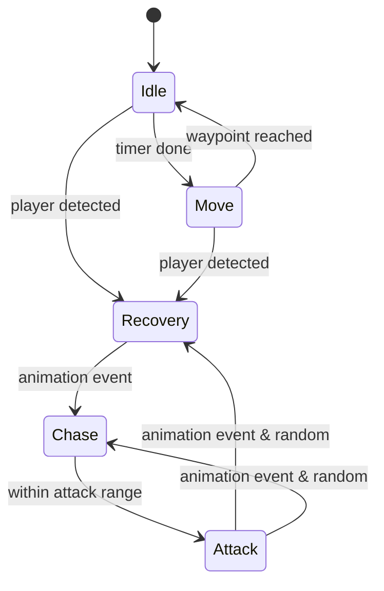

# Enemy State Machine

The melee enemies in this project use a simple finite state machine (FSM) implemented in C#. Each enemy owns an `EnemyStateMachine` instance that manages transitions between states derived from `EnemyState`.

## Pipeline Overview

1. **Initialization** – `Enemy_Melee` creates all state instances (idle, move, recovery, chase and attack) in `Awake`. On `Start`, the FSM is initialized with the idle state.
2. **Update Loop** – Every frame the current state’s `Update` method runs via `stateMachine.currentState.Update()`.
3. **State Logic** – States change based on timers or player distance. When a transition is needed, `ChangeState` is called on the state machine.
4. **Animation Events** – `EnemyAnimationEvents` raises events from animation clips to the current state, allowing transitions to trigger when an animation reaches a specific frame. It also toggles manual movement during attack animations.

## States

- **IdleState_Melee** – Waits for `idleTime`. If the player enters `aggressionRange`, transitions to `RecoveryState_Melee`. Otherwise it moves to `MoveState_Melee` when the timer expires.
- **MoveState_Melee** – Patrols between predefined points using `NavMeshAgent`. If the player comes within the aggression range it switches to `RecoveryState_Melee`. When the destination is reached it returns to idle.
- **RecoveryState_Melee** – Plays a preparation animation while stopping the agent. When the animation triggers, it transitions to `ChaseState_Melee`.
- **ChaseState_Melee** – Continuously updates the agent’s destination toward the player. If the player is inside `attackRange`, switches to `AttackState_Melee`.
- **AttackState_Melee** – Executes the attack animation. Depending on an internal random check, once the animation trigger fires the enemy either returns to recovery or continues chasing.

## Mermaid Diagram

